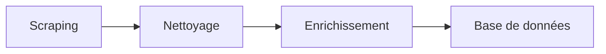

# Glossaire et Concepts Clés pour Débutants en Data Science

## 📖 Glossaire

1. **Data Engineering**
   - Processus de collecte, stockage et traitement des données
   - Ex: Pipelines ETL, bases de données, APIs

2. **Machine Learning (ML)**
   - Algorithmes qui apprennent à partir de données pour faire des prédictions
   - Ex: Classification, régression, clustering

3. **NLP (Natural Language Processing)**
   - Traitement automatique du langage naturel
   - Ex: Analyse de sentiments, reconnaissance d'entités

4. **API (Application Programming Interface)**
   - Interface qui permet à des applications de communiquer entre elles
   - Ex: API REST pour échanger des données JSON

5. **Dashboard**
   - Interface visuelle pour afficher des indicateurs clés (KPIs)
   - Ex: Tableaux de bord avec graphiques et métriques

6. **CI/CD (Continuous Integration/Continuous Deployment)**
   - Automatisation des tests et déploiements
   - Ex: GitHub Actions pour tester et déployer du code

## 💡 Concepts Importants à Comprendre

### 1. Architecture du Projet
```
.
├── core/           # Logique métier et modèles
├── presentation/   # Interfaces (API, dashboard)
├── infrastructure/ # Connexions bases de données
├── notebooks/      # Exploration et expérimentation
└── tests/          # Tests automatisés
```

### 2. Flux de Données
```
Collecte → Nettoyage → Analyse → Visualisation
```

### 3. Bonnes Pratiques
- **Documentation**: Toujours commenter votre code
- **Tests**: Vérifier que votre code fonctionne comme prévu
- **Versioning**: Utiliser Git pour suivre les modifications

### 4. Outils Essentiels
- Python (langage principal)
- Pandas (manipulation données)
- Scikit-learn (machine learning)
- Streamlit (dashboards)
- Docker (conteneurisation)

## 🚀 Pour Commencer
1. Explorez les notebooks dans `notebooks/` pour voir des exemples
2. Consultez `src/` pour le code de collecte et nettoyage
3. Lancez le dashboard avec `streamlit run presentation/dash/streamlit_app.py`

## 🧠 Concepts Spécifiques au Projet

### 1. Data Mining avec Scraping et APIs
- **Scraping**: Extraction de données de sites web (Trustpilot, Amazon)
- **APIs Twitter/Google**: Récupération d'avis via des APIs officielles
- **Gestion des limites**: Respect des taux d'appel et rotation des IP

### 2. ETL (Extract, Transform, Load)


### 3. Modélisation ML et Analyse de Sentiments
- **BERT/Transformers**: Modèles NLP avancés pour comprendre le contexte
- **Motifs d'insatisfaction**: Détection de problèmes spécifiques (livraison, qualité)
- **Faux positifs/négatifs**: 
  - Faux positif: Avis positif classifié négatif
  - Faux négatif: Avis négatif classifié positif
  - Amélioration: Ré-étiquetage manuel, augmentation des données

### 4. Présentation des Résultats
- **Streamlit**: Création rapide de dashboards interactifs
- **KPIs business**: Taux de satisfaction, temps de résolution
- **Visualisations**: Graphiques temporels, cartes thermiques

### 5. Reclassification des Notes et Analyse Contextuelle
- **Dissonance note/texte**:
  - Cas: Note 4/5 avec avis négatif
  - Solution: Ré-évaluer le sentiment basé sur le contenu textuel
- **Détection de triggers d'insatisfaction**:
  - Mots-clés: "déçu", "problème", "insatisfait"
  - Contextualisation avec NLP pour comprendre les causes racines
- **Analyse des émotions secondaires**:
  - Détection de la frustration, colère ou déception même dans des avis "neutres"

### 6. Améliorations Possibles
- **Intégration temps réel**: Kafka pour le streaming d'avis
- **Alertes automatiques**: Notification des problèmes critiques
- **AB Testing**: Comparaison de modèles en production
- **Analyse comparative**:
  - Comparaison avec les concurrents
  - Benchmark sectoriel

## 🔍 Ressources d'Apprentissage Complètes

### Data Engineering
- [📚 Data Pipelines avec Apache Airflow](https://airflow.apache.org/docs/) - Orchestration de workflows
- [💡 ETL Best Practices](https://www.stitchdata.com/etl/) - Meilleures pratiques d'ETL
- [🔐 Sécurité des données](https://owasp.org/www-project-top-ten/) - OWASP Top 10
- [🌐 Scraping avancé avec Selenium](https://selenium-python.readthedocs.io/) - Pour sites web complexes

### Machine Learning & NLP
- [🧠 Cours NLP avancé](https://www.coursera.org/specializations/natural-language-processing) - Spécialisation Coursera
- [🤗 Hugging Face Transformers](https://huggingface.co/docs/transformers) - Modèles NLP state-of-the-art
- [📊 Évaluation des modèles](https://scikit-learn.org/stable/modules/model_evaluation.html) - Métriques Scikit-learn
- [🧪 Fine-tuning BERT](https://huggingface.co/docs/transformers/training) - Adaptation de modèles pré-entraînés

### Analyse de Sentiments Avancée
- [📖 Analyse des émotions avec NLP](https://neptune.ai/blog/sentiment-analysis-python-textblob-vs-vader-vs-flair) - Comparaison d'outils
- [🎯 Détection de sarcasme](https://www.kaggle.com/c/sarcasm-detection) - Compétition Kaggle
- [🔍 Analyse thématique](https://maartengr.github.io/BERTopic/index.html) - Avec BERTopic

### Visualisation & Dashboarding
- [📈 Maîtrise de Streamlit](https://docs.streamlit.io/) - Documentation officielle
- [✨ Plotly avancé](https://plotly.com/python/) - Visualisations interactives
- [📊 Tableau Public](https://public.tableau.com/) - Pour des dashboards professionnels
- [📱 Dashboards mobiles avec PyWebIO](https://pywebio.readthedocs.io/) - Solutions responsive

### Déploiement & MLOps
- [🐳 Docker pour Data Science](https://docker-curriculum.com/) - Tutoriel Docker
- [🚀 MLOps avec MLflow](https://mlflow.org/docs/latest/index.html) - Gestion du cycle de vie des modèles
- [⚙️ CI/CD avec GitHub Actions](https://docs.github.com/en/actions) - Automatisation des déploiements
- [☸️ Kubernetes pour le machine learning](https://www.kubeflow.org/) - Orchestration de workflows ML

### Projets Pratiques
- [💼 Projet complet de sentiment analysis](https://www.kaggle.com/c/sentiment-analysis-on-movie-reviews) - Compétition Kaggle
- [🌐 Web scraping avancé](https://scrapingclub.com/) - Exercices pratiques
- [📝 Blog sur l'analyse de sentiments](https://towardsdatascience.com/tagged/sentiment-analysis) - Articles récents
- [🔧 Projet ETL complet](https://www.dataquest.io/blog/data-engineering-projects/) - De la collecte au stockage
- [🤖 MLOps en pratique](https://mlops.community/) - Communauté et études de cas

### Amélioration Continue
- [🚀 Optimisation des modèles NLP](https://huggingface.co/docs/optimum/index) - Avec Hugging Face Optimum
- [📈 A/B Testing pour data scientists](https://www.udacity.com/course/ab-testing--ud257) - Cours Udacity
- [🔔 Systèmes d'alerte intelligents](https://prometheus.io/docs/alerting/latest/overview/) - Avec Prometheus
